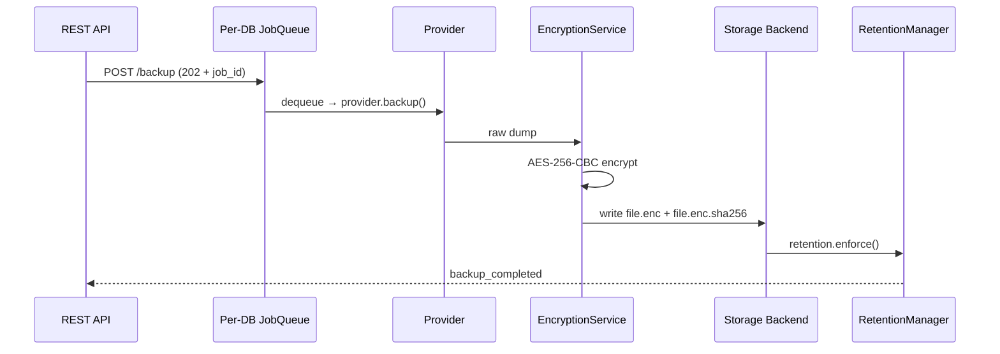
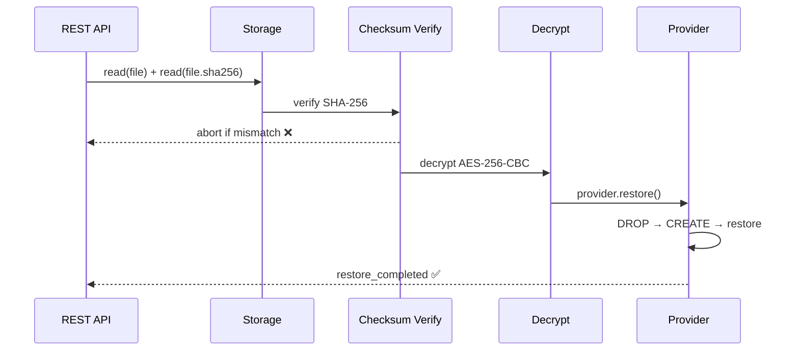

<div align="center">



<br>

### The Docker sidecar that gives any backend automated, encrypted, checksum-verified database backups zero code changes, ever.

[](#current-build-status)
[](requirements.txt)
[](Dockerfile)
[](#supported-databases)
[](LICENSE)

[What it solves](#what-it-solves) ·
[Quickstart](#quickstart) ·
[See it work](#see-it-work) ·
[How it works](#how-it-works) ·
[Why Archon](#why-archon) ·
[API](#api-surface) ·
[Config](#config-in-one-glance)

</div>

<br>

## What it solves

Every backend needs backups. Every team re-solves it from scratch a cron job here, a shell script there, no encryption, no checksum, discovered broken the day it's needed. Then it's rebuilt for the next project, slightly differently, slightly worse.

Archon is built **once**. It runs beside your app as a Docker container, reads one YAML file, and never touches your app's code.

<div align="center">

| Without Archon | With Archon |
|---|---|
| Hand-rolled `pg_dump` cron, no encryption | AES-256-CBC on every file, key never hits disk |
| "Did the backup even work?" | SHA-256 sidecar, verified before every restore |
| Backups pile up until disk fills | Hourly/daily/weekly/monthly retention, auto-enforced |
| Restore = manual SSH + guesswork | One `POST /restore` call, drop-and-recreate, audited |
| Re-implemented per project, per language | One image, one config file, any stack |

</div>

> **Archon is the backup layer that asks nothing of your codebase.** No SDK import, no app-side hook, no vendor lock-in. If you can write a `docker-compose.yml` block, you're done.

<br>

## Quickstart

<table>
<tr>
<td width="50%" valign="top">

**Local / bare Docker**

```bash
openssl rand -hex 32        # → ARCHON_API_KEY
openssl rand -base64 32     # → ENCRYPTION_KEY

docker build -t archon:latest .
cp config.yaml.example archon.config.yaml

docker run --rm \
  -v $(pwd)/archon.config.yaml:/app/config.yaml \
  -v $(pwd)/backups:/app/backups \
  -p 8765:8765 \
  --env-file .env \
  archon:latest
```

</td>
<td width="50%" valign="top">

**docker-compose sidecar**

```yaml
archon:
  image: archon:latest
  volumes:
    - ./archon.config.yaml:/app/config.yaml
    - ./backups:/app/backups
  ports:
    - "8765:8765"
  env_file: .env
```

Add this block to your *existing* `docker-compose.yml`. Nothing else in your project changes.

</td>
</tr>
</table>

<br>

## See it work

<details open>
<summary><b>1 · Kick off a backup, poll the job</b></summary>

```bash
curl -X POST http://localhost:8765/backup \
  -H "X-API-Key: $ARCHON_API_KEY" \
  -d '{"database": "primary_postgres"}'
# → 202 {"job_id": "b3f1...", "status": "queued"}

curl http://localhost:8765/jobs/b3f1... -H "X-API-Key: $ARCHON_API_KEY"
# → {"status": "completed", "file": "archon_primary_postgres_2026-09-21T14-00-01_daily.sql.enc"}
```

Backup requests never block the caller. A second request for the *same* database while one is running queues behind it never dropped, never runs in parallel.
</details>

<details>
<summary><b>2 · Restore, with integrity checked before anything touches your DB</b></summary>

```bash
curl -X POST http://localhost:8765/restore \
  -H "X-API-Key: $ARCHON_API_KEY" \
  -d '{
    "database": "primary_postgres",
    "file": "archon_primary_postgres_2026-09-21T14-00-01_daily.sql.enc",
    "confirm": true
  }'
```

Checksum is verified **before** decryption, decryption happens **before** any DB write. Mismatched `.sha256` sidecar → restore aborts, nothing is touched. `confirm: true` is mandatory there is no silent restore.
</details>

<details>
<summary><b>3 · Browse rows and restore just what you need</b></summary>

```bash
curl -X POST http://localhost:8765/granular/session \
  -H "X-API-Key: $ARCHON_API_KEY" \
  -d '{"database": "primary_postgres", "file": "archon_primary_postgres_..._daily.sql.enc"}'
# → {"session_id": "gs-8821"}

curl http://localhost:8765/granular/session/gs-8821/table/orders/rows -H "X-API-Key: $ARCHON_API_KEY"
```

Not every restore is a full-database rollback. Open a session against a backup, browse tables, pick rows, resolve foreign-key dependencies, and apply just those rows back no full drop-and-recreate needed.
</details>

<details>
<summary><b>4 · Watch it happen live</b></summary>

```bash
curl -N http://localhost:8765/logs/stream -H "X-API-Key: $ARCHON_API_KEY"
```

Every event is structured JSON: `backup_queued` → `backup_started` → `backup_completed` (or `integrity_failed` on a bad restore). Same events also fire as HMAC-signed webhooks if you've configured one no polling required.
</details>

<br>

## How it works

Every backup and every restore goes through the same fixed pipeline no shortcuts, no reordering, ever.





| Layer | Modules | Notes |
|---|---|---|
| API & auth | `app/main.py` `app/api/routes.py` `app/api/middleware.py` | FastAPI, `X-API-Key` header on every route but `/health` |
| Scheduling | `app/scheduler.py` `app/schedule_parser.py` | APScheduler cron, human-readable schedule → cron |
| Pipeline | `app/jobs.py` `app/semaphore.py` `app/retention.py` | per-DB `asyncio.Queue`, `max_parallel` cap, retention enforcement |
| Integrity | `app/encryption.py` | AES-256-CBC + SHA-256, key never written to disk |
| Providers | `app/providers/{postgres,mongodb,sqlite,mysql}.py` | one `BaseProvider`, subprocess calls isolated per-DB |
| Storage | `app/storage/{local,s3,azure}.py` | one `BaseStorage`, cloud SDKs isolated per-backend |
| Granular restore | `app/granular.py` `app/api/granular_routes.py` | row-level session, FK-aware |
| Notifications | `app/webhook.py` | HMAC-signed HTTP events |
| UI | `ui/src/pages/*.tsx` | React 18 + Vite + Tailwind, "Obsidian Command" theme |

<br>

## Why Archon

<div align="center">

| | Archon | Hand-rolled cron script | Managed DB backup (RDS/Atlas) |
|---|:-:|:-:|:-:|
| Works with any Docker-based stack | ✅ | ✅ | ❌ vendor-locked |
| Zero code changes to your app | ✅ | ⚠️ usually not | ✅ |
| AES-256 encryption at rest | ✅ | ❌ usually skipped | ✅ but you don't hold the key |
| SHA-256 verified before every restore | ✅ | ❌ | ⚠️ opaque |
| Multi-DB, multi-storage in one config | ✅ | ❌ one-off per DB | ❌ single provider only |
| Row-level granular restore | ✅ | ❌ | ❌ |
| Self-hosted, you own the backups | ✅ | ✅ | ❌ |

</div>

<br>

## API Surface

| Method | Path | Auth | Returns |
|---|---|:-:|---|
| `POST` | `/backup` | 🔑 | `202` + job ID(s) |
| `GET` | `/jobs/{job_id}` | 🔑 | job status + result |
| `POST` | `/restore` | 🔑 | `200` / `400` / `500` |
| `GET` | `/backups` | 🔑 | extended backup listing |
| `GET` | `/status` | 🔑 | per-database scheduler status |
| `GET` | `/logs` · `/logs/stream` | 🔑 | recent logs / live SSE tail |
| `DELETE` | `/backups/{filename}` | 🔑 | `200` / `404` |
| `POST` | `/reload` | 🔑 | hot-reload config, no restart |
| `POST` | `/granular/session` | 🔑 | start row-level restore session |
| `GET` `/granular/session/{id}/tables` · `/table/{t}/rows` | 🔑 | browse a backup |
| `POST` | `/granular/session/{id}/resolve-multi` · `/restore-multi` | 🔑 | resolve FKs, apply rows |
| `DELETE` | `/granular/session/{id}` | 🔑 | close session |
| `GET` | `/health` | | liveness probe |

<br>

## Config, in one glance

```yaml
databases:
  - name: primary_postgres
    type: postgres
    host: postgres
    port: 5432
    db: mydb
    user: ${DB_USER}
    password: ${DB_PASSWORD}
    schedule:
      frequency: daily
      at: "14:00"
      timezone: "Asia/Kolkata"
    storage: s3
    retention:
      daily: 14
      weekly: 8
```

One block per database. Independent schedule, independent storage target, independent retention mix Postgres, Mongo, SQLite, and MySQL in the same file. Full annotated reference: [`config.yaml.example`](config.yaml.example).

**`.env`:**

```bash
ARCHON_API_KEY=$(openssl rand -hex 32)
ENCRYPTION_KEY=$(openssl rand -base64 32)
DB_USER=myuser
DB_PASSWORD=mypassword
```

<br>

## Supported databases

<div align="center">


</div>

Restore is **always** drop-and-recreate: PostgreSQL drops and recreates the database before `pg_restore`; MongoDB runs `mongorestore --drop`; SQLite replaces the file wholesale. No partial-state surprises.

<br>

## Hard invariants

These never change, by design:

- Backup pipeline: `provider.backup() → encrypt() → checksum() → storage.write() → retention.enforce()`
- Restore pipeline: `storage.read() → verify_checksum() → decrypt() → provider.restore()`
- Checksum verification always happens before decryption, before any DB write
- Every backup gets a `.sha256` sidecar; deleting one deletes both
- Config is read once at startup `POST /reload` is the only way to pick up changes
- DB-specific logic never leaves its provider class; cloud SDK calls never leave their storage class

<br>

## Theme Obsidian Command

<div align="center">

| <br>`#0F1117` | <br>`#6366F1` | <br>`#10B981` | <br>`#F59E0B` | <br>`#F43F5E` |
|:-:|:-:|:-:|:-:|:-:|
| Background | Primary | Success | Warning | Danger |

</div>

Dark charcoal canvas, electric indigo accents, JetBrains Mono for logs and code. Built for the dashboard you glance at during an incident, not a demo.

<br>

## Testing

```bash
pytest tests/ -v                    # full suite
pytest tests/test_encryption.py -v  # single file
```

<br>

## Non-goals (v1)

No Slack/email notifications webhooks already cover events · no point-in-time recovery · no multi-tenant backup granularity · no config hot-watching, reload is explicit via `POST /reload` · no persistent job history beyond in-memory (24h TTL).

---

<div align="center">

**Backups nobody has to think about until the day everybody's glad they exist.**

</div>
